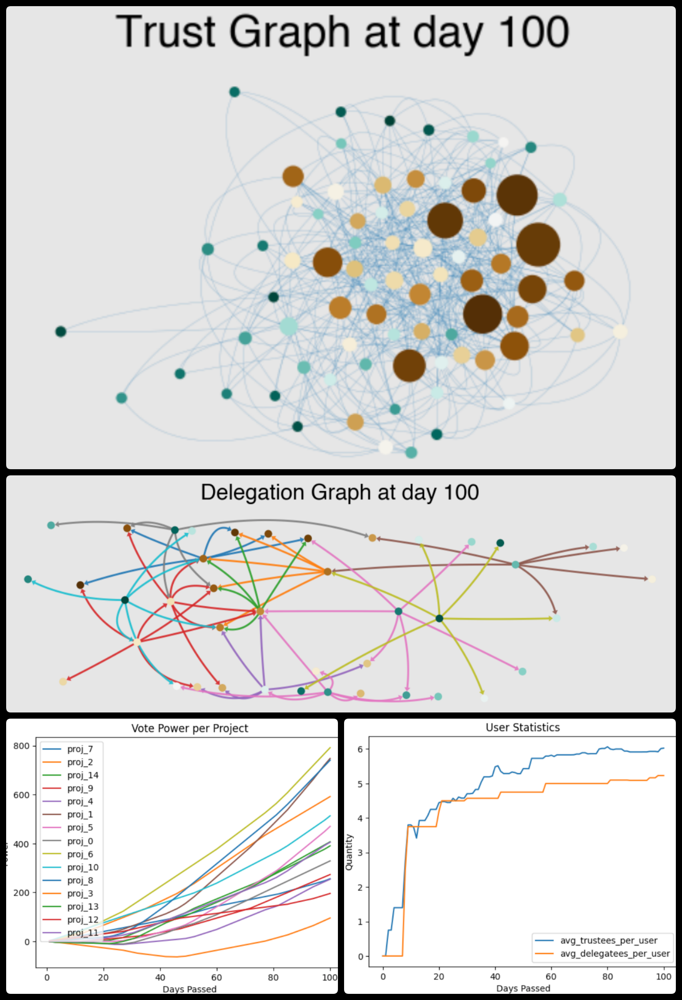
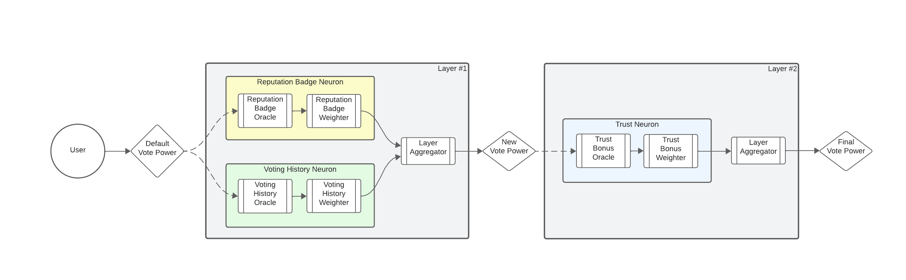

# neural-quorum-governance

Repository for an cadCAD demo on Neural Quorum Governance (NQG). This repository provides a cadCAD simulation for generating synthetic datasets for both user behavior (eg. what drives one to vote, delegate and trust?) and for the resulting outcomes from using pre-defined NQG parametrizations.


*Visualizations from simulation-generated data by using this repo.*

## Introduction 

Neural Quorum Governance (or NQG) is a novel voting-power attribution and delegation mechanism which was ideated, specified and implemented in a joint effort between BlockScience and the Stellar Development Foundation (SDF). The name is a juxtaposition of its two key constituents: Neural Governance, which enables modular, plug-and-play development and exploration of mechanisms for voting-power attribution, and Quorum Delegation, a new delegation scheme which allows users to delegate their votes without having to trust a single delegate.

Neural Governance (NG) is a modular, transparent and flexible architecture for defining a member's Voting Power towards projects in the ecosystem. Neural Governance utilizes the notion of Voting Neurons (composed of an Oracle and Weighting functions) that are layered and aggregated together to form a user’s Voting Power. A full specification, along with a user journey description and simulations for it, can be found in the Soroban Governance Modules Library.

Quorum Delegation (QD) allows users to delegate their votes to private groups (called Quorums) of users that they trust and to place conditions on how much agreement among a Quorum is needed for vote delegation to occur. Users can use Quorum Delegation to manage their involvement in a vote and to protect themselves from rogue delegates by requiring a high level of agreement within their Quorums. It is inspired by Quorums in the Stellar Consensus Protocol and it stands as an innovation when compared to traditional methods of delegation, which tend to rely on individual delegates. A full specification can be found in the Soroban Governance Modules Library.


*Neural Governance in a glance. In this stylized implementation, User Vote Power starts with a default voting power (such as zero), which gets replaced by the voting power that is computed by aggregating the Reputation and Past Voting Neurons weighted outputs. This is then fed to the Trust Neuron, which will then provide the Final User Vote Power.*


## How to run it

- Option 1 (CLI): Just pass `python -m nqg_model`
This will generate an pickled file at `data/simulations/` using the default single run
system parameters & initial state.
    - To perform a multiple run, pass `python -m nqg_model -e`
- Option 2 (cadCAD-tools easy run method): Import the objects at `nqg_model/__init__.py`
and use them as arguments to the `cadCAD_tools.execution.easy_run` method. Refer to `nqg_model/__main__.py` to an example.
- Option 3 (Notebooks)
  - Use any of the provided notebooks on the `notebooks/` folder.

## Folder structure

- `nqg_model/`: cadCAD simulation & workflow utils for NQG
  - `nqg_model/types.py`: Type definitions, including the Model State & Parameters.
  - `nqg_model/structure.py`: Definition of the Simulation State Update Blocks.
  - `nqg_model/params.py`: Definition for the simulation initial state & parameters.
  - `nqg_model/logic.py`: Logic for the State Transition steps. 
  - `nqg_model/neural_quorum_governance.py`: NQG related definitions.
- `notebooks/`
  - `notebooks/sanity_check.ipynb`: Example simulation run for the cadCAD model.
  - `notebooks/proof-of-concept-demo.ipynb`: Static simulation for NQG.

## What is cadCAD

### Installing cadCAD for running this repo

#### 1. Pre-installation Virtual Environments with [`venv`](https://docs.python.org/3/library/venv.html) (Optional):
It's a good package managing practice to create an easy to use virtual environment to install cadCAD. You can use the built in `venv` package.

***Create** a virtual environment:*
```bash
$ python3 -m venv ~/cadcad
```

***Activate** an existing virtual environment:*
```bash
$ source ~/cadcad/bin/activate
(cadcad) $
```

***Deactivate** virtual environment:*
```bash
(cadcad) $ deactivate
$
```

#### 2. Installation: 
Requires [>= Python 3.6](https://www.python.org/downloads/) 

**Install Using [pip](https://pypi.org/project/cadCAD/)** 
```bash
$ pip3 install cadcad==0.4.28
```

**Install all packages with requirement.txt**
```bash
$ pip3 install -r requirements.txt
